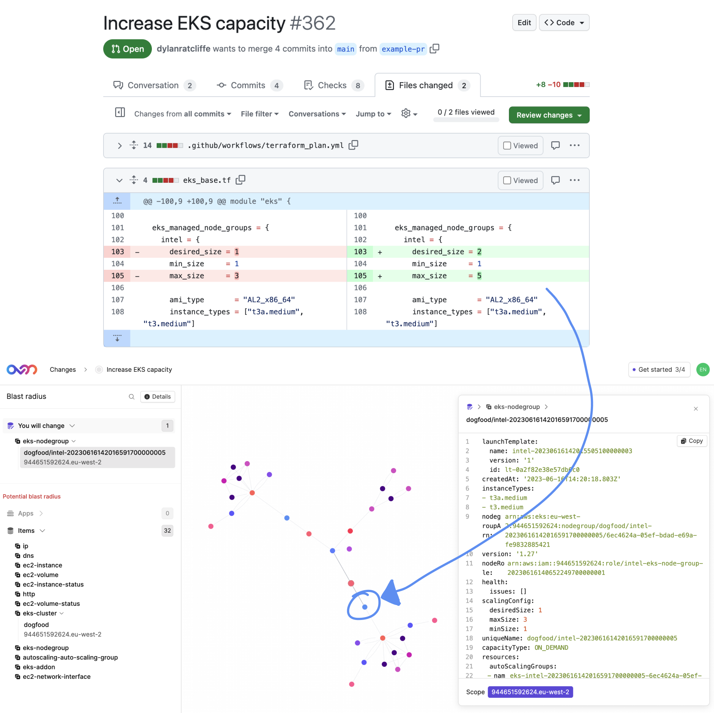
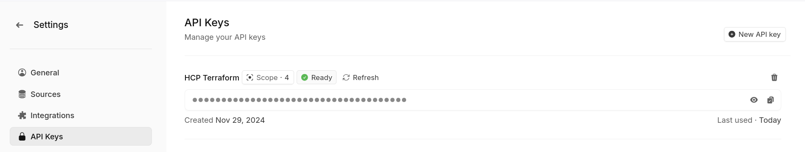

p align="center">
  <picture width="260px" align="center">
      <source media="(prefers-color-scheme: dark)" srcset="https://assets-global.website-files.com/6241e92445c21f9c1245a940/6582c2b96d741b023f1afabf_ov-lite-icon-p-500.png">
      
    </picture>
  <h1 align="center">Overmind Action</h1>
  <p align="center">
     <a href="https://overmind.tech">https://overmind.tech</a> 
    <br/>
This example repo shows how to run terraform on GitHub Actions and automatically submit each PR's changes to [Overmind](https://overmind.tech), reporting back the blast radius as a comment on the PR. You can see that in action in [this PR](https://github.com/overmindtech/terraform-example/pull/57).

<br/>
  </p>
</p>
<br/>

<p align="center">
  <a href="https://discord.com/invite/5UKsqAkPWG" rel="nofollow"></a>
</p>

<p align="center">
  <a href="https://vimeo.com/903381683">🎥 Watch a demo</a> | <a href="https://overmind.tech/how-it-work">📖 How it works</a> | <a href="https://app.overmind.tech/api/auth/signup">🚀 Sign up</a> | <a href="https://app.overmind.tech/playground">💻 Playground</a> | <a href="https://www.linkedin.com/company/overmindtech/">🙌 Follow us</a>
</p>

# Overmind Actions

Use [Overmind](https://overmind.tech/) to calculate the blast radius of your Terraform pull requests.

<details>
  <summary>Not using GitHub?</summary>

  Currently we only have an action for GitHub, but don't fear! We have a CLI that you can use to integrate your own CI tooling:

  1. Download the CLI from here: https://github.com/overmindtech/ovm-cli/releases
  2. Set the `OVM_API_KEY` environment variable to your API Key
  3. Add a step to your pipeline to create a change:

  ```
  ./ovm-cli submit-plan \
    --title 'Pull request title goes here' \
    --description 'PR description goes here' \
    --ticket-link 'link to PR goes here' \
    --plan-json 'path/to/plan.json'
  ```
</details>



# Usage

The `install` action installs the [`ovm-cli`](https://github.com/overmindtech/ovm-cli).

```yaml
- uses: overmindtech/actions/install-cli@main
  with:
    version: latest # Request a specific version for install. Defaults to `latest`.
    github-token: ${{ secrets.GITHUB_TOKEN }} # Avoid API limits (optional)
    github-api-url: https://ghe.company.com/api/v3 # API for GitHub Enterprise Server (optional)
```

The `submit-plan` action takes a JSON-formatted terraform plan, creates a Overmind Change for it, and runs Impact Analysis.

```yaml
- uses: overmindtech/actions/submit-plan@main
  id: submit-plan
  with:
    ovm-api-key: ${{ secrets.OVM_API_KEY }} # Generated within Overmind
    plan-json: ./tfplan.json # Location of the plan in JSON format
```

## Complete example

Copy this workflow to `.github/workflows/overmind.yml` to run `terraform init`, `terraform plan` and submit the planned changes to Overmind.

> Note: This example does not include any configuration to allow terraform access to your infrastructure.

```yaml
name: Terraform Validation
on: [pull_request]

jobs:
  plan:
    runs-on: ubuntu-latest
    permissions:
      contents: read # required for checkout
      pull-requests: write # create/update a comment
    concurrency:
      group: tfstate # avoid running more than one job at the same time

    steps:
      # Checkout your code
      - uses: actions/checkout@v4

      # Set up Terraform
      - uses: hashicorp/setup-terraform@v3
        with:
          terraform_wrapper: false
      - name: Terraform Init
        id: init
        shell: bash
        run: terraform init -input=false

      # Run Terraform plan. Note that these commands will allow terraform to
      # log nicely and also create a plan JSON file
      - name: Terraform Plan
        id: plan
        run: |
          set -o pipefail -ex
          terraform plan -no-color -input=false -out tfplan 2>&1 \
            | tee terraform_log
          terraform show -json tfplan > tfplan.json

      # Install the Overmind CLI
      - uses: overmindtech/actions/install-cli@main

      # Submit the plan. This will add a comment with the blast radius
      - uses: overmindtech/actions/submit-plan@main
        id: submit-plan
        with:
          ovm-api-key: ${{ secrets.OVM_API_KEY }}
          plan-json: ./tfplan.json
          plan-output: ./terraform_log
```

## Creating an API Key

To create an API key to use with this action go to [Account Settings > API Keys](https://app.overmind.tech/changes?settings=1&activeTab=api-keys) and click "New API Key".



Give the key a name e.g. "Github Actions" and select the `changes:write` permission and click "Confirm". This will create the API key and authorize it. The key should then display as "Ready" in the UI.

You can then copy the API key and [create a secret](https://docs.github.com/en/actions/security-guides/using-secrets-in-github-actions#creating-secrets-for-a-repository) called `OVM_API_KEY` in Github Actions. The action will now be ready to use.

# Development

Install [nektos/act](https://github.com/nektos/act) and run

```
gh act pull_request -s GITHUB_TOKEN="$(gh auth token)" -s OVM_API_KEY="${OVM_API_KEY}"
```

to try out the `selftest` action locally. It's much faster than commit/push.
